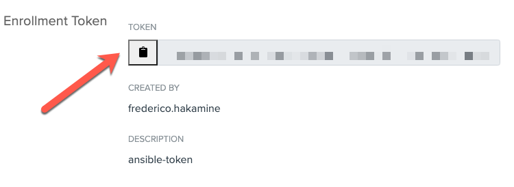
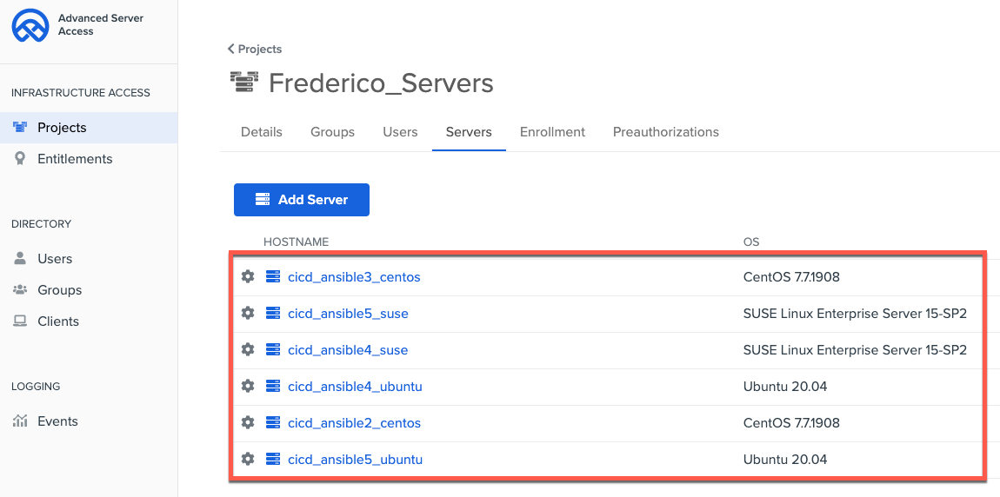

# asa-ansible-example

This is a sample Ansible playbook for enrolling and securing access to servers with Okta Advanced Server Access (ASA).

To leverage this example, you must have access to an Ansible controller and Okta ASA as administrator.

**NOTE:** If you don’t have an Okta ASA account yet, you can go and [create one here](https://app.scaleft.com/p/signup).


# Setup

Step 1: Clone this repository:

```
git clone https://github.com/sudobinbash/asa-ansible-example.git
cd asa-ansible-example
```

Step 2: Edit the `asa-playbook.yml`. On line 3, replace `<hosts>` with the hosts you want to enroll in ASA:

```
-
  name: Install SFT
  hosts: <hosts>
```

Step 3: Get An Enrollment in ASA:

1. Access Okta ASA as Administrator.
2. Click **Projects** and then select or create a new project.
3. Click **Enrollment** > **Create Enrollment Token**.
4. Enter a name (i.e. `ansible-token`) and click **Submit**.
5. Copy the enrollment token



Step 4: Install the Ansible Galaxy module for zypper (required for installing ASA in SUSE Linux):

```
ansible-galaxy install community.general.zypper
```

Step 5: Enroll servers using the ansible-playbook command:

```
ansible-playbook asa-playbook.yml -i <inventory> --extra-vars "asa_enrollment_token=<token>"
```

Replace: 
- `<inventory>`: with your inventory file (or any list of servers)
- `<token>`: with the enrollment token from ASA

Ansible will run and register your servers, and return the following:


In ASA, you will see the servers enrolled in your project:




## Power Tips / FAQ

**Wait... what does the `asa-playbook.yml` do?**

The playbook installs the ASA server agent and then enroll your servers into ASA for remote access.

The playbook supports multiple Linux distros using the server distro family to identify the ideal installation tasks:

```
  tasks:     
    #INSTALL
    - name: Install Debian
      include_tasks: asa-samples/install-debian.yml
      when: ansible_facts['os_family'] == "Debian"
    
    - name: Install RedHat
      include_tasks: asa-samples/install-redhat.yml
      when: ansible_facts['os_family'] == "RedHat"
    
    - name: Install Suse
      include_tasks: asa-samples/install-suse.yml
      when: ansible_facts['os_family'] == "Suse"
```

The steps for enrolling the servers are the same across all Linux distros, and listed on the after the installation tasks.

**How do I define the server names listed in ASA? (aka Canonical Names)**

Servers are registered in ASA with a canonical name that can be used to launch ssh sessions (i.e. `ssh <canonical-name>`). Our playbook uses the Ansible `inventory_hostname` as canonical name. You can change the canonical name according to your preferences, using variables and server facts from Ansible.

```
    - name: Creating canonical file (using server names from the inventory)
      copy:
        dest: "/etc/sft/sftd.yaml"
        content: |
          ---
          # CanonicalName: Specifies the name clients should use/see when connecting to this host.
          CanonicalName: "{{ inventory_hostname }}"
      become: yes
```

**Can I use this playbook with other Ansible provisioning modules?**

Yes. You can use this sample with any other module available in [Ansible](https://docs.ansible.com/ansible/latest/collections/index.html) or the Ansible Galaxy. This includes provisioning modules to IaaS providers and Hypervisors, such as [AWS](https://docs.ansible.com/ansible/latest/collections/amazon/aws), [VMWare](https://docs.ansible.com/ansible/latest/collections/community/vmware), [GCP](https://docs.ansible.com/ansible/latest/collections/google/cloud), [OpenStack](https://docs.ansible.com/ansible/latest/collections/openstack/cloud), and [Azure](https://docs.ansible.com/ansible/latest/collections/azure/azcollection). To do this, use the inventory plugins available with these modules to capture the inventory of servers and tags to apply the playbook.

**Any extra recommendations?**

Absolutely yes:

1. **Experiment before broad rollout:** Use the `asa-playbook.yml` with few servers before a broad rollout (i.e. set `hosts: all`).
2. **Store the enrollment token in Ansible Vault:** In our example, we set the `asa_enrollment_token` variable directly in the ansible-playbook command for testing purposes. If you expect to run this command multiple times in production, we recommend using a secret manager, like [Ansible's vault](https://docs.ansible.com/ansible/2.8/user_guide/vault.html). Here's a [cool example from Tristan Fisher](https://gist.github.com/tristanfisher/e5a306144a637dc739e7).
3. **Securing the Ansible Controller**: You can also secure access to the Ansible controller server with ASA using the same playbook. To do that, update your `asa-playbook.yml`, changing the hosts to `local`, and then run the playbook pointing to local: `ansible-playbook  -c local -i localhost asa-playbook.yml --extra-vars "asa_enrollment_token=<local>"`
